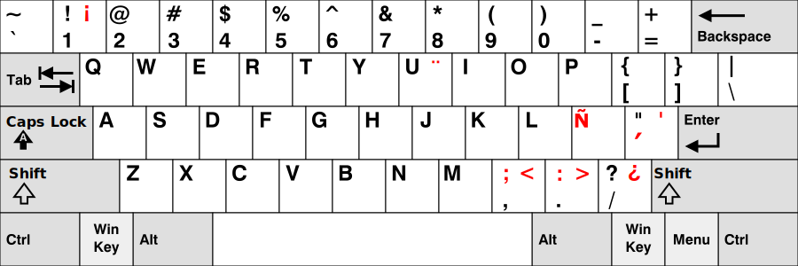

# Spanglish Keyboard Layout

Este repositorio proporciona una distribución para hacer más usables los teclados ingleses para los hispanohablantes.

Normalmente para los programadores es más eficiente usar teclados ingleses, ya que la syntaxis de los lenguajes de programación está optimizada para la disposición de estos teclados, pero tenemos el inconveniente de que nos faltan algunas letras del alfabeto español tales como la 'ñ' o las tildes.

Una solución es usar la disposición US internacional disponible en todos los sistemas operativos, pero esta disposición hace incómodo el escribir las letras específicas del español por no estar en la disposición habitual, sobre todo para los que hemos practicado mucha mecanografía.

El objetivo de esta disposición es modificar el layout de un teclado US lo menos posible pero hacerlo confortable para escribir en español.

Estos son los cambios principales que se han hecho (en rojo):

Por ahora los sistemas operativos soportados son MacOs, Linux y Android.

MacOS
=====

Copiar la carpeta `spanglish.bundle` a `$HOME/Keyboard\ Layouts`.

Una vez copiada, cerrar la sesión y volver a entrar. En la configuración de teclado aparecerá la nueva disposición **Spanglish**.

Linux
=====

Copiar la carpeta `xkb` a `$HOME/.config`.

Una vez copiada, cerrar la sesión y volver a entrar. En la configuración de teclado aparecerá la nueva disposición **Spanglish**.

Android
=======

Descargar el .apk disponible en la [última release](https://github.com/bladecoder/spanglish-keyboard-layout/releases/latest) e instalarlo en el dispositivo.

Una vez instalada, en la configuración de teclado externo aparecerá la nueva disposición **Spanglish**.

